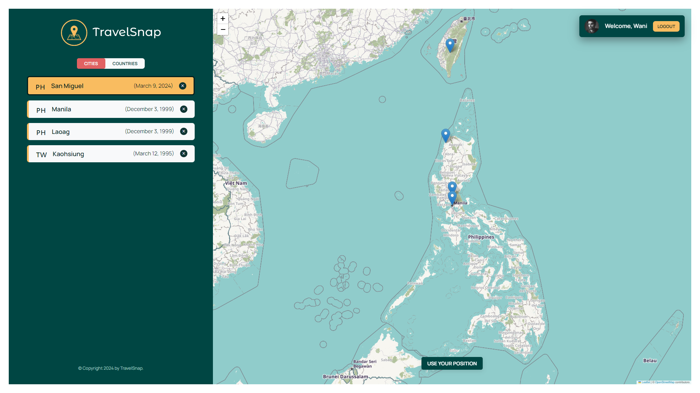

<!-- PROJECT LOGO -->
<br />
<h1 align="center">TravelSnap</h1>

<!-- ABOUT THE PROJECT -->

## About The Project



<p align="center">
Welcome to Travelsnap, your go-to travel diary application for documenting your adventures around the world. With Travelsnap, you can effortlessly save and revisit the places you've traveled to, ensuring that your cherished memories are always just a tap away. 
</p>

<!-- APPLICATION'S FEATURES -->

## 📝 Features

- Interactive Map

  - Travelsnap boasts an interactive map feature that allows you to visualize your travel journey in a dynamic and engaging way.
  - Pinpoint the locations you've visited on the map, creating a personalized and visually captivating representation of your travels.
  - Easily navigate the map to explore different regions, countries, and cities, providing you with a comprehensive overview of your global adventures.

- City and Country List:

  - Seamlessly add the cities and countries you've visited or plan to visit to your personal list, ensuring that your travel itinerary is always organized and accessible.
  - Enhance your city entries by ataching personal notes and dates, allowing you to capture and preserve your memories in a meaningful way.

- City Details

  - The City Details feature enhances the user experience by providing comprehensive and insightful information about visited cities, enabling users to reminisce about their travels and discover more about the destinations they've explored.

<!-- TECHNOLOGY USED -->

## 👨‍💻 Technology Used

The Wild Oasis Hotel Management Application is built using the following technologies and libraries:

- **React**: React is a JavaScript library for building user interfaces, offering a declarative approach to creating reusable UI components.

  - **React Router**: React Router is a routing library for React applications, enabling dynamic navigation without page reloads.

- **Leaflet**: Leaflet is an open-source JavaScript library for interactive maps, providing lightweight and customizable mapping solutions.

- **CSS Modules**: CSS Modules is a CSS organization technique that scopes styles locally to components, enhancing maintainability and readability.

- **Vite**: Vite is a modern build tool for web development, optimized for fast development and production builds with support for React, Vue, and other frameworks.

<!-- LIVE DEMO -->

## 🚀 Live Demo

[https://travelsnap.vercel.app/](https://travelsnap.vercel.app/)

## 🛠 Run Locally

<p>1. Clone the repository</p>

```
git clone https://github.com/jcWani/travelsnap.git
```

<p>2. Install required dependencies </p>

```
npm install
```

<p>3. Launch the development server</p>

```
npm run dev
```

<p>4. Open the application at</p>

```
http://localhost:5173
```

<!-- ACKNOWLEDGEMENTS -->

## Acknowledgments

This application served as the one of the projects developed during "The Ultimate React Course 2024: React, Redux & More" on [Udemy](https://www.udemy.com/course/the-ultimate-react-course), instructed by [Jonas Schmedtman](https://twitter.com/jonasschmedtman).
